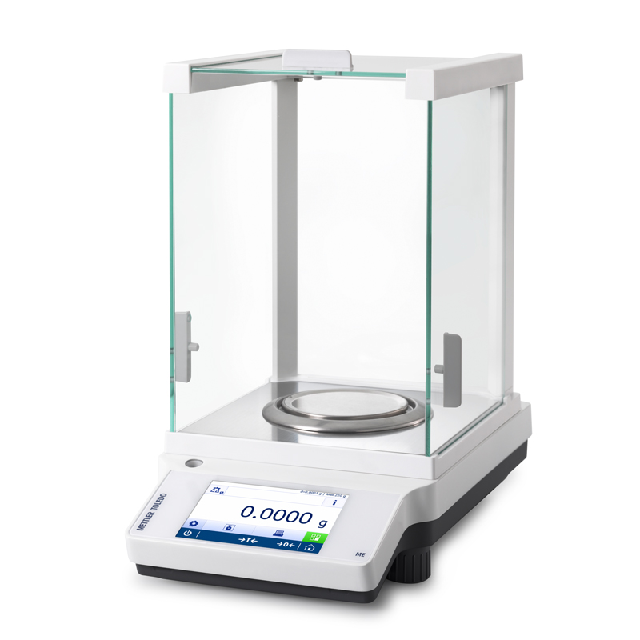

## 6.1

> 약병 20개가 있다. 이 중 19개는 1.0그램짜리 알약들이 들어 있고, 하나에
> 는 1.1그램들이 알약들이 들어있다. 정확한 저울 하나를 써서, 무거운 약
> 병 하나를 찾으려면 어떻게 하면 되겠는가? 저울은 딱 한 번 쓸 수 있다.

박수원
<details>
<summary>접기/펼치기 버튼</summary>

  
  
  
  ```
  주어진 약병에 순서를 매겨, 각 약병에서 순서만큼의 알약을 꺼내 저울에 놓는다.
  저울에 나온 실측 값에 모든 얄약이 1.0g이라고 가정했을때 나와야하는 값 210.0g의 차이를 구한다.
  위에서 구한 차이에 10을 곱한 순서의 약병이 무거운 약병이다.
  
  ```
  
  
이미지 출처 : https://www.kolab-shop.com/data/item/1531637763/1.jpg
이미지 출저 : https://png.pngtree.com/element_our/20200610/ourmid/pngtree-simulation-bottle-medicine-bottle-image_2236609.jpg

</details>
