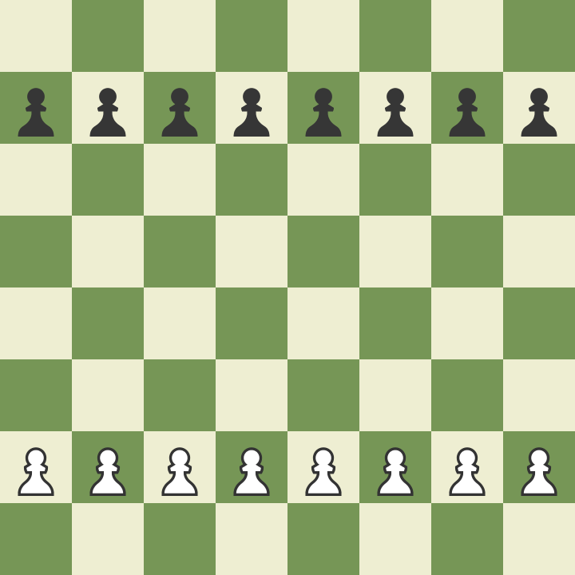

## 6.2

> 8x8 체스판이 있다. 그런데 대각선상으로 반대편에 있는 두 개의 모서리가 떨어져 나갔다.
> 31개의 도미노가 주어지는데, 하나의 도미노는 정확히 2개의 정사각형을 덮을 정도의 크기이다.
> 이 31개의 도미노를 사용해서 보드 전체를 덮을 수 있겠는가? 제출한 답이 옳다는 것을 증명하라.
> (예를 들거나, 왜 불가능한지를 보이면 된다.)

김건희
<details>
<summary>접기/펼치기 버튼</summary>

  
  
  
  
  ```
  
  답은 불가능 하다 일단 위의 체스판을 봐보자,
  체스판은 8x8 64개로 32개의 흰색칸과 32개의 검은색 칸이 교차해서 나있다.
  그리고 대각선상에 반대편에 있는 두 개의 모서리를 땔 경우(여기서는 검은색) 
  30개의 검은색 칸과 32개의 흰색 칸이 나있다.
  
  우리가 정의한 도미노의 크기는 정확히 두개의 정사각형을 덮을 크기라고 정의했는데 색이 교차하는 체스판 특성상 
  검은색 하나 하얀색 하나 씩 차지하게 된다. 이는 31개의 도미노 블록이 있다면 31개의 검은색 블록과 31개의 하얀색 블록을 
  차지한다는 것을 알 수 있다. 하지만 여기서 모서리를 날린 그림은 30개의 검은색 칸과 32개의 하얀색 칸이므로 불가능하다. 
  
  직접 놔보는 수도 있지만 모서리가 늘 한칸씩 밀리면서 마지막엔 불가능해지는 것도 알 수 있다.
  
  ```
  
  
이미지 출처 : https://www.chess.com/ko/article/view/ceseupaneul-seolcihaneun-bangbeob

</details>
